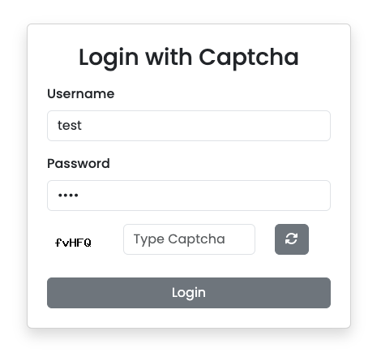

# Recaptcha Package

Paket ini menyediakan layanan untuk menghasilkan dan memverifikasi **CAPTCHA** berbasis teks dan angka. Anda dapat menggunakan paket ini untuk melindungi formulir dan halaman web Anda dari bot dan skrip otomatis.

## Fitur

- Menghasilkan CAPTCHA berbasis **teks alfanumerik** (huruf dan angka).
- Menghasilkan CAPTCHA berbasis **angka**.
- Memverifikasi CAPTCHA yang dimasukkan oleh pengguna.
- Menyimpan CAPTCHA dalam sesi untuk memverifikasi input pengguna.

## Instalasi

1. **Unduh atau Salin Kode:**
   Pastikan Anda memiliki kode sumber paket ini di dalam proyek Anda. Anda bisa mengunduhnya atau menyalin folder `Recaptcha` ke dalam proyek Anda.

2. **Autoloading (Opsional, jika menggunakan Composer):**
   Jika Anda menggunakan Composer untuk autoloading, pastikan kelas `Recaptcha` dapat ditemukan dengan menambahkan namespace-nya di `composer.json`.

   ```json
   "autoload": {
       "psr-4": {
           "Recaptcha\\": "path/to/recaptcha/"
       }
   }
   ```
### 1. **Jika Menggunakan Composer (Dari Packagist)**

Anda bisa menambahkannya sebagai dependensi:

```bash
composer require captchaforce/recaptcha
```

## Implementation Recaptcha


- **CaptchaType Text**
```php
use Recaptcha\Recaptcha;
use Recaptcha\CaptchaType;

Recaptcha::setCaptcha(5);
Recaptcha::captchaImage(Recaptcha::getCaptcha(CaptchaType::TEXT));
```
- **CaptchaType Number**
```php
use Recaptcha\Recaptcha;
use Recaptcha\CaptchaType;

Recaptcha::setCaptcha(5);
Recaptcha::captchaImage(Recaptcha::getCaptcha(CaptchaType::NUMBER));
```
- **Change length Captcha**
```php
Recaptcha::setCaptcha(8);
```
- **Verify Captcha**
```php
use Recaptcha\Recaptcha;

$result = Recaptcha::verifyCaptcha($text_inputan_user);
echo $result ? "Captcha valid" : "Captcha tidak valid !";
```

## Run Samples
```bash
php -S localhost:8080 -t samples
```

## Implementation Recaptcha ( CodeIgniter 3 )
- Login.php (Controllers)
```php
<?php
defined('BASEPATH') or exit('No direct script access allowed');

use Recaptcha\Recaptcha;

class Login extends CI_Controller
{
    public function __construct()
    {
        parent::__construct();
        Recaptcha::setCaptcha(5); // Bagian terpenting
    }
    
    public function index()
    {
        $this->load->view('dashboard/login');
    }
}
```
- Captchaimg.php (Controllers)
```php
<?php
defined('BASEPATH') or exit('No direct script access allowed');

use Recaptcha\Recaptcha;
use Recaptcha\CaptchaType;

class Captchaimg extends CI_Controller
{   
    public function index()
    {
        Recaptcha::captchaImage(Recaptcha::getCaptcha(CaptchaType::NUMBER)); // Bagian terpenting
    }
}
```
- Auth.php ( Controllers )
```php
public function login()
{
    if ($this->input->post()) {
        $this->form_validation->set_rules('username', 'Username', 'required');
        $this->form_validation->set_rules('password', 'Password', 'required');
        $this->form_validation->set_rules('captcha', 'Captcha', 'required');

        if ($this->form_validation->run() === TRUE) {
            $username = $this->input->post('username');
            $password = $this->input->post('password');
            $captcha = $this->input->post('captcha');

            if(Recaptcha::verifyCaptcha($captcha)) { // Bagian terpenting
                $user = $this->user->login($username, $password);

                if ($user) {
                $this->session->set_userdata('user', $user);
                
                redirect('dashboard');
                } else {
                    $data['error'] = 'Username atau password salah.';
                }
            }else{
                $data['error'] = 'Captcha salah';
            }
        } else {
            $data['error'] = validation_errors();
        }
    }

    $this->load->view('login');
}
```
- login.php (Views)
```html
<form action="<?php echo site_url('auth/login'); ?>" method="post">
    <div class="form-wrapper">
        <input type="text" name="username"  placeholder="Username" class="form-control" required>
        <i class="zmdi zmdi-account"></i>
    </div>
    <div class="form-wrapper">
        <input type="password" name="password" placeholder="Password" class="form-control" autocomplete required>
        <i class="zmdi zmdi-lock"></i>
    </div>

    <div class="form-wrapper">
        <div class="row">
            <div class="col">
                " alt="Gambar Captcha"> <!-- Bagian terpenting -->
            </div>
            <div class="col">
                <input type="text" name="captcha" placeholder="Type Captcha" class="form-control" required>
                <i class="zmdi zmdi-lock"></i>
            </div>
        </div>
    </div>
    <button type="submit" id="loginBtn">Masuk
        <i class="zmdi zmdi-arrow-right"></i>
    </button>
</form>
```

## Test Code
### MacOs
```bash
./vendor/bin/phpunit --testdox tests
```
### Windows
```bash
php ./vendor/bin/phpunit --testdox tests
```